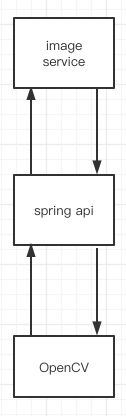
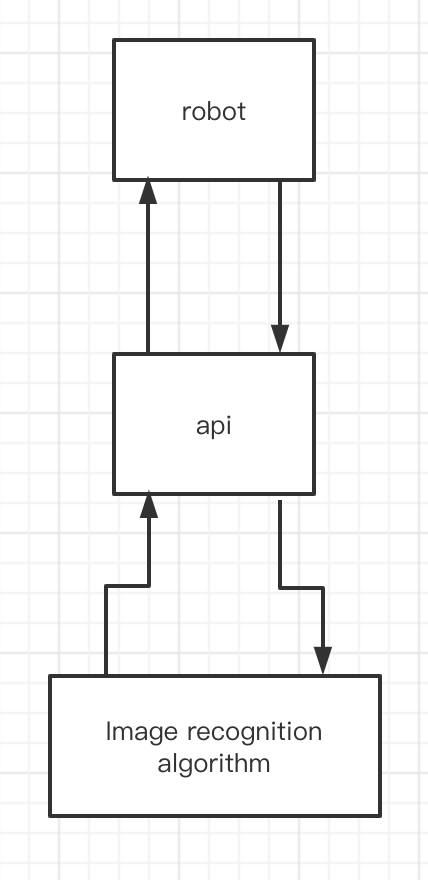

# avoid-obstacles
Obstacle avoidance module of sweeping robot.

The purpose of this project is to solve the problem of robot avoiding obstacles.

Technology selection:

* image：spring framework + maven
* api：spring framework + maven
* algorithm：spring framework + maven + OpenCV framework

Project architecture diagram:

Project flow chart：

